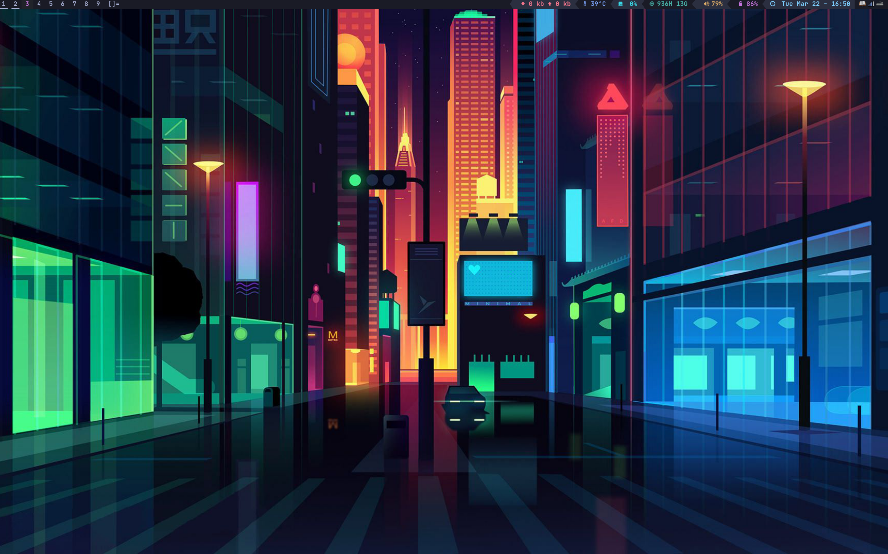
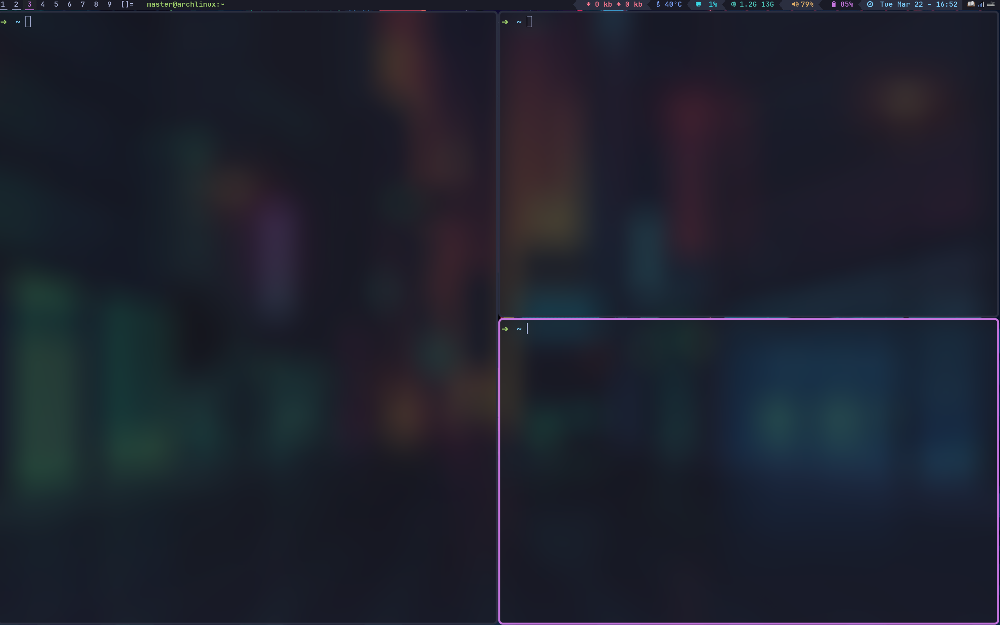

# DWM

This repositories is my dwm configration.

## My Computer

+ OS: Arch Linux x86-64 -- 5.15.2-arch1-1
+ Host: 82L5 Lenovo XiaoXinPro 16ACH 2021
+ Window manager: DWM

## Effect

Desktop



Terminal look



## Install

do the command:

```shell
sudo make clean install
```

## Set

You can edit the file [config.h](./config.h)
to build your own dwm, there are 3 themes you can change.

+ [gruvbox](./themes/gruvbox.h)
+ [onedark](./themes/onedark.h)
+ [tokyonight](./themes/tokyonight.h)

## Where I Got This

+ [roidm's setting](https://gitlab.com/roidm/suckless)
